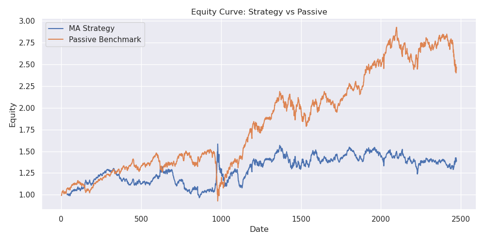
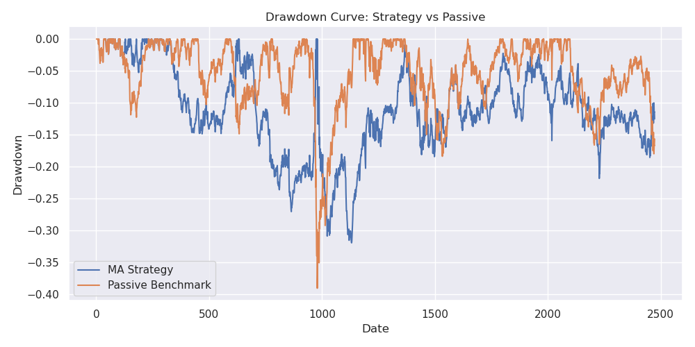

# Moving Average Crossover Strategy

### Personal Quant Research Memo
- **Study Period:** 06 Apr 2016 – 06 Apr 2026
- **Data Frequency:** Daily
- **Instrument:** Nifty 50 Futures
- **Model:** 9 / 36 Moving Average Crossover
- **Test Split:** Final 20% of observations held out for out-of-sample evaluation

---

# Executive Summary

This study evaluates a 9/36 moving average crossover strategy against passive long exposure to Nifty 50 futures over a 10-year period using daily data.

Results indicate that the crossover model did **not outperform passive exposure on total return over the full sample**, but it did reduce drawdown and showed stronger performance in selected market regimes.

The strategy performed best during the pre-Covid period, underperformed materially during the Covid recovery regime, and delivered modest but slightly better results than passive exposure in the final out-of-sample period.

Overall, the model appears more useful as a **risk-management or tactical overlay** than as a pure return-maximizing standalone strategy.

---

# Equity Curve

---

# Drawdown Curve

---

# Methodology

- Signals generated on the close of day **t**
- Positions implemented for day **t+1**
- No lookahead bias in signal generation
- Fully invested positioning
- Long and short exposure permitted
- Transaction assumptions included:
  - STT
  - Slippage
  - Rollover costs

---

# Performance Comparison

| Dataset | Model | Sharpe | CAGR | Max Drawdown | Calmar |
|--------|------|-------:|------:|-------------:|-------:|
| Pre-Covid | Passive | 0.23 | 2.5% | -39.0% | 0.06 |
| Pre-Covid | MA Crossover | **0.47** | **7.2%** | **-27.0%** | **0.27** |
| Covid | Passive | **2.60** | **65.3%** | **-10.2%** | **6.39** |
| Covid | MA Crossover | 1.15 | 21.1% | -16.9% | 1.24 |
| Post-Covid | Passive | **0.94** | **12.8%** | -18.4% | **0.70** |
| Post-Covid | MA Crossover | 0.22 | 2.0% | **-17.6%** | 0.12 |
| Out-of-Sample | Passive | -0.06 | -1.7% | **-17.9%** | -0.10 |
| Out-of-Sample | MA Crossover | **0.09** | **0.2%** | -18.7% | **0.01** |
| Overall | Passive | **0.64** | **9.6%** | -39.0% | **0.25** |
| Overall | MA Crossover | 0.29 | 3.4% | **-31.9%** | 0.11 |

---

# Regime Analysis

## Pre-Covid

The crossover model performed best during this period, outperforming passive exposure across return and risk metrics. This suggests cleaner trend structure and favorable momentum persistence.

## Covid

Passive exposure strongly outperformed. The sharp rebound following the crash favored continuous long positioning, while trend-following systems can lag during rapid reversals.

## Post-Covid

The model underperformed significantly. Higher trade frequency suggests whipsaw conditions and reduced trend persistence.

## Out-of-Sample Period

Both approaches produced weak returns. However, the crossover model marginally exceeded passive exposure, indicating some robustness despite low absolute performance.

## Full Sample

Passive exposure produced materially higher CAGR and Sharpe ratio. The crossover model, however, reduced peak drawdown by roughly 7 percentage points.

---

# Trading Activity

| Dataset | Trades / Year |
|--------|--------------:|
| Pre-Covid | 6.6 |
| Covid | 3.6 |
| Post-Covid | 8.6 |
| Out-of-Sample | 10.5 |
| Overall | 8.2 |

Higher trade counts in later periods are consistent with noisier market structure.

---

# Interpretation

The 9/36 crossover does not appear to generate persistent excess return over passive futures exposure after realistic costs. Its primary value lies in:

- Drawdown reduction
- Systematic positioning discipline
- Potential diversification with other strategies
- Tactical trend participation during cleaner regimes

As a standalone strategy, return performance was insufficient to justify replacing passive exposure over this sample.

---

# Limitations

- Single market study (Nifty futures only)
- Single parameter pair (9/36)
- Daily frequency only
- Leverage not included
- Historical backtest; live execution may differ
- Futures carry dynamics may vary over time

---

# Final Conclusion

The strategy demonstrates some defensive and regime-dependent usefulness but does not outperform passive Nifty futures exposure over the full 2016–2026 sample.

The most reasonable practical use case is as a component within a broader portfolio of uncorrelated strategies rather than as a sole investment system.
